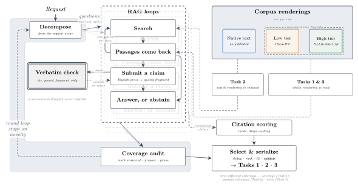
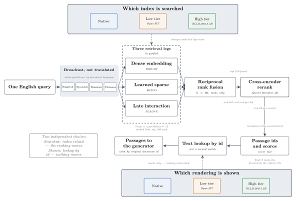
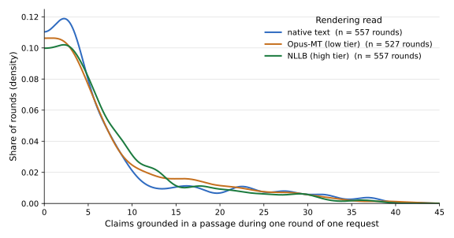
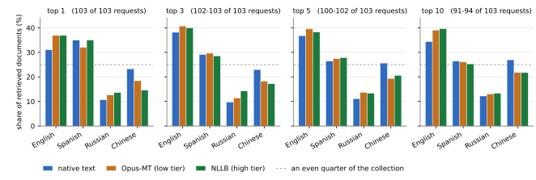
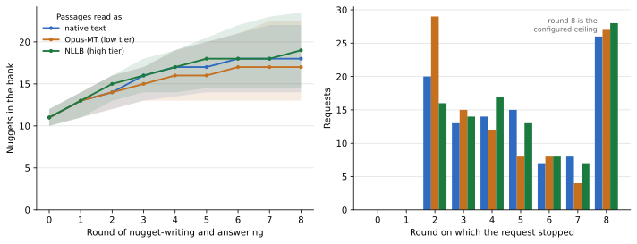

# TREC RAGTIME 2026 — BiTeM, HES-SO Geneva

This repository holds our participation in [TREC RAGTIME 2026](https://trec-ragtime.github.io/), a
track that pairs an English report request with a news collection in Chinese, English, Russian and
Spanish. A system must return an English report, within a length limit, in which every sentence
cites the documents that support it. Most of the evidence is therefore not in the language of the
report, and a system has to bridge that gap somewhere: by translating the collection before it is
indexed, by translating a retrieved passage before the model reads it, or by leaving the bridge to
the model. The first two choices are normally made together, which leaves the contribution of each
unrecoverable. We varied them independently, and call the two choices knobs: which rendering is
searched, and which rendering the model reads.

Every non-English sentence exists in three renderings that share passage ids: the native text, a
low-tier translation by Helsinki Opus-MT, and a high-tier translation by NLLB-200-3.3B. An English
sentence is the same in all three. One agentic retrieval-augmented pipeline serves the three tasks
— report generation (Task 1), multilingual information retrieval (Task 2), and autonuggetization
(Task 3), which asks for the single-sentence questions, or nuggets, a report should cover. The runs
form two families, one per knob. The reading family searched the native index and varied only the
rendering read; the searching family read native text and varied only the rendering indexed. Within
a family the twelve blocks that fix shared infrastructure are byte-identical, which a check enforces
before launch.

We filed nine files over the same 103 report requests. Six come from the three reading runs
(`e2e-original`, `e2e-omt-weak`, `e2e-omt`), each of which produced a Task 1 report and a Task 3
nugget bank, and two from the searching runs `mlir-omt-weak` and `mlir-omt`. The ninth, the Task 2
list for the native index, was serialized from the `e2e-original` cells rather than from a separate
`mlir-original` execution, because those two configurations are identical on both knobs. It is
consequently not an independent observation of the Task 1 native run, so their agreement is not
evidence about either.

Reading a translation costs loops. Over the 103 report requests the three reading runs ran 2,855
retrieval loops on native text, 3,209 on Opus-MT and 3,523 on NLLB, and 32, 39 and 45 per cent of
those loops closed without grounding a claim. Both quantities rise as the translation gets better,
which we did not expect. What is submitted converges even so: each report cites a median of 28 to
29 sentences, and 99 per cent of those sentences draw on a single document each rather than
combining several; the nugget bank grows from 11 to a median of 17 to 19 before a near-duplicate
merge takes the submitted bank to a median of 17, 15 and 16. Any two Task 2 runs share about a
third of their ranked documents, and applying the same measure to the three Task 1 runs, which
searched one index between them, gives a comparable figure.

The official evaluations have not been returned, and we will add them here when they are. The
organisers compute the measures over pooled judgements, counting a document relevant in Task 2 if
it supports at least one nugget; no relevance judgements are available to participants, so nothing
below is a measure of retrieval quality. Each task's `SUBMISSION_INFO.txt` records the order in
which we asked for our three runs to be assessed. Because every arm was executed once, at
temperature 0.7, the official numbers will let us report a difference between renderings rather
than establish one.

## The pipeline



**Decompose** reads the report request and nothing else. It drafts a first nugget bank, then revisits
its own list once — merging near-duplicates, adding facets of the request it missed, and scoring how
central each question is. Each nugget is a single-sentence question that the report should cover, so
the bank states what the request asks for rather than what the collection happens to hold — no
passage has been retrieved at this point.

**RAG loop** runs once per open nugget, which means the bank, rather than a fixed setting, decides
how many loops a round contains. Each loop begins with a **Search** and receives **Passages** in
return. It then submits a **Claim**: English prose together with a quoted fragment. Only the
fragment is checked, and it must appear character for character in the passage that loop was shown.
The prose may therefore paraphrase or translate, while the quotation cannot drift from the text the
model actually read. That text is the rendering the arm was configured to read, so in the two
translated arms the quotation is verbatim against the translation and not against the source
document. The loop then submits an **Answer** to its nugget, or **abstains** when no passage
supports one. A loop is bounded at five searches and eight generation calls, so a nugget that resists
grounding costs a bounded amount rather than holding up the round.

**Coverage audit** reads the answers, together with a capped sample of the passages behind them, and
edits the nugget bank. It marks nuggets answered, prunes the ones that went off target, and proposes
new nuggets of two kinds: gaps it can point at in the evidence it read, and facets the request asks
for that nothing has surfaced yet. The second kind is why a bank can grow past what the collection
happened to return. The round then repeats. A request stops when two consecutive audits each add no
more than one new nugget, or when the round ceiling stops it first.

**Citation scoring** puts a number on every citation the committed claims made and writes them to
`citation_scores/scores.jsonl`, one row per claim and cited document. Each score is the product of
two judgements: the importance of the nugget the claim answers, and how much of that nugget's
question the claim answers, the second judged from the question and the claim sentence with no
passage shown. The stage fills in values only — which documents a claim cites was settled in the
loop and is not revised here — and it writes no submission file. Select and serialize is what
consumes the scores, in all three tasks: they rank the documents of Task 2, and the highest score
among an answer's citations becomes that answer's score, which picks each nugget's best answer for
Task 1, orders the claims that fill the residual length budget, and caps how many answers a nugget
carries into Task 3.

**Select and serialize** is the only stage that knows about the tasks, and it writes all three
submission files, each from a different part of the run. **Task 1** is a coverage-first greedy
selection over the committed claims: each nugget contributes its best-scoring answer, nuggets taken
in order of importance, and the residual length budget is then filled by nugget importance times
answer score; the result is fitted to the report length limit the track sets and then validated.
**Task 3** is the nugget bank itself, deduplicated and capped. **Task 2** is a ranking of documents
rather than passages, built here from the same claims: a document's score is the sum of the citation
scores of the claims citing it, so a document cited repeatedly accumulates. Equal totals are then
separated rather than left tied, because a TREC run file cannot express an order between equal
scores: the evaluator discards line order and re-sorts them by document id, which is arbitrary with
respect to relevance. Each tied group is spread through the gap to the next distinct score
in order of the document's mean reranker log-probability, so no two documents share a score in any
of the three filed runs.

## The retrieval stack



**Dense embedding**, **Learned sparse** and **Late interaction** each use their own checkpoint. A
search query, which the loop writes and which is not the report request, is encoded three times:
by `BAAI/bge-m3`, by `omai-research/milco-650m`, and by
`hltcoe/plaidx-large-neuclir-mtd-mix-passages-mt5xxl-engeng`. Each retriever keeps its own notion of
what makes a passage close to a query.

The collection is partitioned by each passage's own source language into English, Spanish, Russian
and Chinese. A translated index keeps the same four partitions, because the key is where a passage
came from rather than what language it now reads in. Each of the three retrievers runs against each
of the four partitions, so one search produces twelve ranked lists, each 100 passages deep. The query
goes to all four exactly as the loop wrote it — nothing in the retrieval path translates it.

**Reciprocal rank fusion** merges the twelve lists into one ranking, in which a passage that placed
modestly in several lists can finish ahead of one that placed well in a single list. Twelve lists
of 100 bound the merged ranking at 1,200 passages, and overlap between the lists brings it well
below that.

The top 100 of the merged ranking go to **Cross-encoder rerank**, which scores each passage against
the query with Qwen3-Reranker-4B. A cross-encoder reads the query and the passage together rather
than comparing two vectors computed separately. That is more accurate and far more expensive, so
it runs only on the head of the ranking. The rescoring is spread across six GPU instances.

The top 20 come back as passage ids and scores, never as text. The client fetches the text
separately by id, which is what keeps the rendering a stage reads independent of the index that was
searched. Each score is the reranker's log-probability, so no score is positive and the ranking
runs from the value closest to zero downward.

## What is in this repository

| Path | Contents |
| --- | --- |
| `src/ragtime/` | The pipeline, in dependency order: `common` (ids, schemas, paths, artifact IO), `config` (validation, hashing, the fairness gate), `serving` (the model factory and node lifecycle), `orchestration` (planning, SLURM, the work queue, the `run` entry point), `preprocess` (corpus build, translation, indexing), `retrieval` (query-time fusion, reranking, the service client), `devkit` (the long-lived retrieval service every run was served by), `pipeline` (decomposition, the loops, the coverage audit, scoring, serialization) |
| `config/` | The six run configurations and the serving specifications. Each run file is self-contained: every choice a run makes is inlined, so the file is the complete record of that run |
| `slurm/` | The launchers: the retrieval service, the generator service and its workers, the run monitor, the serialization fan, the index acceptance check, and the dataset upload |
| `analysis/` | The scripts behind the statistics below and the tables they produce, together with two utilities that serve the data release |
| `docs/` | [`REPRODUCE.md`](docs/REPRODUCE.md) for the steps to rebuild a run, [`pipeline.md`](docs/pipeline.md) for what each stage does, [`PROVENANCE.md`](docs/PROVENANCE.md) for how the shipped index was built and checked, [`HUGGINGFACE.md`](docs/HUGGINGFACE.md) for the data release, and the figures |
| `tests/` | The test suite, split into a cheap tier and a full-data tier |
| `submission/` | The files filed with TREC, exactly as submitted, with a reader's guide to which run is which arm |

The environment is managed with uv against a committed lock file and a pinned Python version:

```
uv sync
uv run run --config config/<run>.yml
```

The pipeline assumes a SLURM cluster with several GPU nodes. The generator is
Qwen3.5-122B-A10B-FP8, served by vLLM. Retrieval runs as a single long-lived service that keeps one
whole rendering of the collection resident in memory, and clients reach that service over a shared
filesystem. A run expands into a job graph whose final stage is a monitoring rollup. That stage is
not implemented in this release, and `run --stage monitor` reports as much.

## Descriptive statistics of the run

The measurements below cover the same three renderings over the same 103 report requests, and name
them in the same order throughout: native text, the Opus-MT translation (the low tier), and the
NLLB translation (the high tier). Tasks 1 and 3 vary the rendering the model reads and hold the
index native; Task 2 varies the rendering indexed and holds the reading native. The two limits
stated at the top govern every figure here: each arm was executed once, so every number is a
point estimate, and no relevance judgements are available, so nothing below measures quality. The
full tables are in [`analysis/`](analysis/), and the figures they build are in
[`docs/figures/`](docs/figures/).

### Task 1 — report generation

We produced three sets of reports over the same report requests. All three searched the same native
index and differed only in which rendering of a retrieved passage the model read.



| Rendering read | Cited sentences per report (median, IQR) | Claims grounded per round (median, IQR) | Retrieval loops | Loops that grounded nothing |
| --- | ---: | ---: | ---: | ---: |
| native text | 28 (22–32) | 4 (2–9) | 2855 | 904 (32%) |
| Opus-MT (low tier) | 29 (20–33) | 5 (2–11) | 3209 | 1265 (39%) |
| NLLB (high tier) | 29 (20–32) | 5 (2–9) | 3523 | 1589 (45%) |

The three sets of reports land within one sentence of each other, and in all three 99 per cent of
the sentences that carry a citation draw on a single document each, rather than combining two or
three; a sentence citing two documents occurs 24, 16 and 16 times. What differs is the work behind
them. Reading native passages reaches that result on 19 per cent fewer loops than reading NLLB and
11 per cent fewer than reading Opus-MT, and it grounds more of its evidence in the first round:
2,142 claims, against 1,894 through Opus-MT and 1,683 through NLLB.

We can offer a mechanism but not evidence for it. A claim is committed only if its quoted fragment
appears in the passage verbatim, so one explanation is that exact quotation is harder to extract
from a translation and the loop spends more attempts getting it. The run does not distinguish that
from the alternatives, and the full table records one of them: loops that ended in an error
rather than an empty result rise from 35 to 90 to 151 across the three renderings, while answered
loops stay flat near 1,940. Separating the two would need the per-loop drop reasons, which the
pipeline records and this analysis does not yet read.

Full tables, the per-round breakdown and the citations-per-sentence figure:
[`analysis/claims_per_round_and_topic.md`](analysis/claims_per_round_and_topic.md).

### Task 2 — multilingual information retrieval

We produced three ranked lists over the same report requests. They differ only in which rendering
of the collection was searched. The collection is divided evenly among the four languages, so 25
per cent is the reference line.



Every run over-retrieves English and under-retrieves Russian at every depth. Searching a translated
collection pulls the head of the ranking toward English and away from Chinese, and Chinese at rank
one falls monotonically across the three renderings, from 23.3 to 18.4 to 14.6 per cent. The
pattern is clearest there; English at rank one rises from 31.1 per cent and then stays flat at 36.9
across both translated arms, and the deeper ranks are not monotone. Spanish is almost unaffected,
and Russian moves slightly in the opposite direction. Retrieval depth is a property of each run
rather than a fixed cut-off, so the deeper measurements rest on fewer report requests, 91 to 94 of
the 103 at rank ten.

The three runs also disagree about which documents they retrieve. Overlap below is the number of
documents two runs share divided by the number in either of them, and the order column is Kendall's
tau over the documents a pair has in common, where +1 is the same order and 0 an unrelated one.

| Comparison | Shared of top 10 | Overlap, top 10 | Overlap, whole list | Order of shared documents | Same document first | Task 1 comparison |
| --- | ---: | ---: | ---: | ---: | ---: | ---: |
| native text vs Opus-MT | 4.1 of 10 | 0.29 | 0.33 | +0.38 | 37 of 103 | 0.36 |
| native text vs NLLB | 4.0 of 10 | 0.28 | 0.33 | +0.36 | 33 of 103 | 0.35 |
| Opus-MT vs NLLB | 4.5 of 10 | 0.33 | 0.36 | +0.41 | 33 of 103 | 0.37 |
| all three at once | | 0.17 | 0.21 | | | 0.23 |

Agreement is worse at the head than over the whole list, 0.30 against 0.34 on average — worst exactly
where a reader looks. The documents a pair does share are not merely reshuffled: a tau of about
+0.38 is clearly positive but a long way from the +1 that reordering one common pool would give.
So the runs disagree both about which documents are found and about where they are placed.

The last column is a caution rather than a control. It applies the same overlap measure to the
three Task 1 runs, which searched one index between them and varied only what the model read, and
gets a comparable figure — so the Task 2 disagreement cannot be attributed to the searched
rendering alone. Two caveats keep it from being a true control: it compares cited documents where
Task 2 compares retrieved ones, and its native member is the same execution as Task 2's native
member, so the two columns are not independent.

Full tables, the four depth cut-offs and the agreement figure:
[`analysis/task2_language_mix.md`](analysis/task2_language_mix.md) and
[`analysis/strategy_agreement.md`](analysis/strategy_agreement.md).

### Task 3 — autonuggetization

Task 3 uses the same three runs as Task 1, measured on the nugget bank each report request
accumulated. The first bank is drafted from the report request alone; every later round adds what
the coverage audit found missing, whether it could point at the gap in the evidence that round had
just read or it was a facet of the request nothing had surfaced yet.



Reading passages yields roughly 70 per cent more nuggets than the report request alone: a first
bank of 11 grows to a median of 17 to 19, by factors of 1.70, 1.66 and 1.73 across the three
renderings. Those factors are close enough that one execution each cannot separate them. The
first bank reads no passage at all, so the rendering a run reads cannot have shaped it, and the
renderings can only diverge in the rounds that follow.

Two qualifications apply. For about a quarter of report requests the loop stopped because it hit
the configured round ceiling, not because the audit had run out of nuggets, so those banks were
still growing when it was cut off. And the drop from the grown bank to the submitted one is almost
entirely the near-duplicate merge, which collapses nuggets that ask the same question; our own
30-nugget cap, which is not a track rule, is reached for at most one report request in a hundred.

Full tables, where in the rounds each nugget came from and the submitted-bank figure:
[`analysis/nuggets_per_round_and_topic.md`](analysis/nuggets_per_round_and_topic.md).

## The dataset

The sentence-level view of the collection that the pipeline builds is published on the Hugging Face
Hub as [`jknafou/trec-ragtime-2026`](https://huggingface.co/datasets/jknafou/trec-ragtime-2026), a
derivative of [`trec-ragtime/ragtime2`](https://huggingface.co/datasets/trec-ragtime/ragtime2). It
holds four configs of one relational model: our sentence segmentation, which carries the text of
each sentence and its character offsets; the two English translations of every non-English
sentence; and the passages that group sentences into retrieval units. The offsets locate a sentence
within its document as we normalised that document. They support ordering and adjacency, and they
are not a way to cut text out of the parent, because the normalised document text is not published.

| Config | Rows | What it is |
| --- | ---: | --- |
| `sentences` | 88,719,200 | Our segmentation, each sentence with its text and its offsets |
| `translations_nllb` | 55,919,788 | Each non-English sentence translated into English by NLLB-200-3.3B, short sentences grouped into one translation unit |
| `translations_opus` | 55,919,788 | The same sentences translated one at a time by three small bilingual Helsinki Opus-MT models |
| `passages` | 9,941,840 | The retrieval units, each a contiguous run of sentences |

The four configs hold 210,500,616 rows in all. The parent's 4,000,380 documents are not among them.
That document table belongs to the parent release and joins back on an unchanged document id, so
shipping it again would add four million rows of someone else's data to a release that otherwise
contains only our own contributions and pointers into theirs.

The release turns on the shared passage ids. One passage under one id can be read as native text,
as our NLLB English or as our Opus-MT English, and any citation resolves back to the original
document id. Comparing a system across the three renderings is therefore a change of lookup, and
raises no alignment problem.

The data inherits the parent's CC-BY-SA-4.0 licence, which requires attribution, a statement of
what we changed, and redistribution under the same licence. The translation models carry their own
licences. Our reading is that those apply to the models rather than to their output, but the
question is not settled and the argument is set out in full where it is made. That licence differs
from the licence on the code in this repository, which is MIT; see [`LICENSE`](LICENSE).
[`docs/HUGGINGFACE.md`](docs/HUGGINGFACE.md) sets out the reasoning behind the release: the card
front-matter, the column schema of every config, the rule for rebuilding a passage in each
rendering, and the licence argument that put all four configs under CC-BY-SA-4.0.

## Citation

A paper describing these runs is in preparation. This section will carry the reference once it is
published.

```bibtex
% to be added
```
